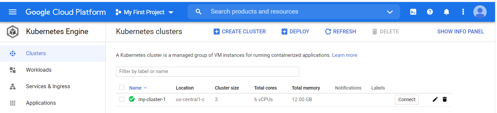

## Get access to Google Cloud Platform
For this workshop, you will have access....

Alternatively, you can create a Google Cloud account and you will get a free credit worth of 300$ and valid for 90 days. 
Login to the [Google Cloud Platform console](https://console.cloud.google.com/).

## Create your cluster
In the [Google Cloud Platform console](https://console.cloud.google.com/), start your first project (FIXME tbc with a fresh account).
Search and select "Kubernetes Engine" in the search field ("Search products and resources").
Click on "Clusters" in the left bar, and in the screen that opens, choose "Create new cluster". Create a cluster with the default values.
Once created, you will see it listed as shown:

<kbd>

</kbd>

## Open the working environment

You can work from the cloud shell, which opens from an icon in the tool bar, indicated by the red arrow in the figure below:

<kbd>

</kbd>

In the following, all the commands are typed in that shell. 
We will make use of many `kubectl` commands. If interested, you can read [an overview](https://kubernetes.io/docs/reference/kubectl/overview/) of this command line tool for Kubernetes.

## Install argo as a workflow engine

A workflow engine is needed to define and submit jobs. In this tutorial, we use [argo](https://argoproj.github.io/argo/quick-start/) as a workflow engine.
You can install it in your working environment with the following commands:

```bash
kubectl create ns argo
kubectl apply -n argo -f https://raw.githubusercontent.com/argoproj/argo/stable/manifests/quick-start-postgres.yaml
curl -sLO https://github.com/argoproj/argo/releases/download/v2.10.0-rc3/argo-linux-amd64
chmod +x argo-linux-amd64
sudo mv ./argo-linux-amd64 /usr/local/bin/argo
```

Argo documentation advises GKE users to setup the following, replace YOURNAME and YOUREMAIL with your own user name and email:

```bash
kubectl create clusterrolebinding YOURNAME-cluster-admin-binding --clusterrole=cluster-admin --user=YOUREMAIL@gmail.com
```

You can now check that argo is available with

```bash
argo version
```

## Run a simple test workflow

To test the setup, run a simple test workflow with

```bash
argo submit -n argo --watch https://raw.githubusercontent.com/argoproj/argo/master/examples/hello-world.yaml
argo list -n argo
argo get -n argo @latest
argo logs -n argo @latest
```

## Define the volumes

The test job above did not produce any ouput data files, just text logs. 
The data analysis jobs will produce output files and, in the following, we will setup a volume where the output files will be written and from where they can be fetched.
All definitions are passed as "yaml" files, which you've already used in the steps above. 
First, we will define a "persistent volume claim". Create a file `pvc-demo.yaml` with the following content:

```yaml
# pvc-demo.yaml
apiVersion: v1
kind: PersistentVolumeClaim
metadata:
  name: pvc-demo
spec:
  accessModes:
    - ReadWriteOnce
  resources:
    requests:
      storage: 3Gi
```


Create and check the volume claim with 

```bash
kubectl apply -f pvc-demo.yaml -n argo
kubectl get pvc -n argo
```

You will see an output similar to this

```
NAME       STATUS   VOLUME                                     CAPACITY   ACCESS MODES   STORAGECLASS   AGE
pvc-demo   Bound    pvc-55449e93-3d4b-4078-b044-bc7b4514797b   3Gi        RWO            standard       2m
```


Note that it may take some time before the STATUS gets to the state "Bound"

Now we can use this volume in the workflow definition. Create a workflow definition file `argo_wf_volume.yaml` with the following contents:

```yaml
apiVersion: argoproj.io/v1alpha1
kind: Workflow
metadata:
  generateName: test-hostpath-
spec:
  entrypoint: test-hostpath
  volumes:
    - name: task-pv-storage
      persistentVolumeClaim:
        claimName: pvc-demo
  templates:
  - name: test-hostpath
    script:
      image: alpine:latest
      command: [sh]
      source: |
        echo "This is the ouput" > /mnt/vol/test.txt
        echo ls -l /mnt/vol: `ls -l /mnt/vol`
      volumeMounts:
      - name: task-pv-storage
        mountPath: /mnt/vol
```


Submit and check this workflow with 

```bash
argo submit -n argo argo_wf_volume.yaml 
argo list -n argo 
```

Take the name of the workflow from the ouput (replace XXXXX in the following command) and check the logs

```bash
kubectl logs pod/test-hostpath-XXXXX  -n argo main
```

Once the job is done, you will see something like:

```
ls -l /mnt/vol: total 20 drwx------ 2 root root 16384 Sep 22 08:36 lost+found -rw-r--r-- 1 root root 18 Sep 22 08:36 test.txt
```

## Get the ouput file

The example job above produced a text file as an output. It resides in the persistent volume that the workflow job has created. 
To copy the file from that volume to the cloud shell, we will define a container, a "storage pod" and mount the volume there so that we can get access to it.

Create a file `pv-pod.yaml` with the following contents:

```yaml
apiVersion: v1
kind: Pod
metadata:
  name: pv-pod
spec:
  volumes:
    - name: task-pv-storage
      persistentVolumeClaim:
        claimName: pvc-demo
  containers:
    - name: pv-container
      image: busybox
      command: ["tail", "-f", "/dev/null"]
      volumeMounts:
        - mountPath: /mnt/data
          name: task-pv-storage
```

Create the storage pod and copy the files from there

```bash
kubectl apply -f pv-pod.yaml -n argo
kubectl cp  pv-pod:/mnt/data /tmp/poddata -n argo
```
and you will get the file created by the job in `/tmp/poddata/test.txt`.

## Run a CMS open data workflow

If the steps above are successful, we are now ready to run a workflow to process CMS open data.

Create a workflow file `argo-workflow.yaml` with the following content:

```yaml
apiVersion: argoproj.io/v1alpha1
kind: Workflow
metadata:
  generateName: nanoaod-argo-
spec:
  entrypoint: nanoaod-argo
  volumes:
  - name: task-pv-storage
    persistentVolumeClaim:
      claimName: pvc-demo
  templates:
  - name: nanoaod-argo
    script:
      image: cmsopendata/cmssw_5_3_32
      command: [sh]
      source: |
        source /opt/cms/entrypoint.sh
        sudo chown $USER /mnt/vol
        mkdir workspace
        cd workspace
        git clone git://github.com/cms-opendata-analyses/AOD2NanoAODOutreachTool  AOD2NanoAOD
        cd AOD2NanoAOD
        scram b -j8
        nevents=100
        eventline=$(grep maxEvents configs/data_cfg.py)
        sed -i "s/$eventline/process.maxEvents = cms.untracked.PSet( input = cms.untracked.int32($nevents) )/g" configs/data_cfg.py
        cmsRun configs/data_cfg.py
        cp output.root /mnt/vol/
        echo  ls -l /mnt/vol
        ls -l /mnt/vol
      volumeMounts:
      - name: task-pv-storage
        mountPath: /mnt/vol
```

Submit the job with

```bash
argo submit -n argo argo-workflow.yaml --watch
```

The option `--watch` gives a continuous follow-up of the progress. To get the logs of the job, use the process name (`nanoaod-argo-XXXXX`) which you can also find with

```bash
argo get -n argo @latest
```

and follow the container logs with

```bash
kubectl logs pod/nanoaod-argo-XXXXX  -n argo main
```

Get the output file `output.root` from the storage pod in a similar manner as it was done above.



