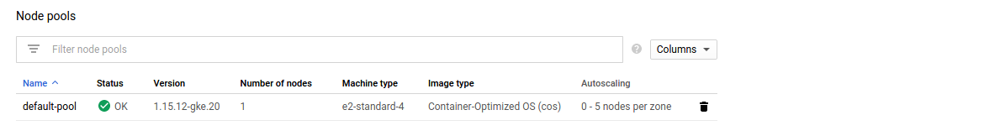
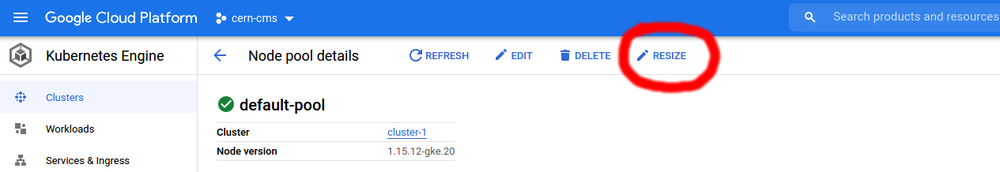

## Autoscaling

Google Kubernetes Engine allows you to configure your cluster so that it is automatically rescaled based on pod needs.

When creating a pod you can specify how much of each reasource a container needs. More information on compute resources can be found on [Kubernetes pages](https://kubernetes.io/docs/concepts/configuration/manage-resources-containers/). This information is then used to schedule your pod. If there is no node matching your pod's requirement then it has to wait until some more pods are terminated or new nodes is added.

Cluster autoscaler keeps an eye on the pods scheduled and checks if adding a new node, similar to the other in the cluster, would help. If yes, then it resizes the cluster to accommodate the waiting pods.

Cluster autoscaler also scales down the cluster to save resources. If the autoscaler notices that one or more nodes are not needed for an extended period of time (currently set to 10 minutes) it downscales the cluster.

To configure the autoscaler you simply specify a minimum and maximum for the node pool. The autoscaler then periodically checks the status of the pods and takes acton accordingly. You can set the configuration either with the `gcloud` command-line tool or via the dashboard.

## Deleting workflows automatically

## Scaling down

Occasionally, the cluster autoscaler cannot scale down completely and extra nodes are left hanging behind. Some sithuations like those can be found documented [here](https://github.com/kubernetes/autoscaler/blob/master/cluster-autoscaler/FAQ.md#i-have-a-couple-of-nodes-with-low-utilization-but-they-are-not-scaled-down-why). Therefore it is useful to know how to manually scale down your cluster.

Click on your cluster, listed at `Kubernetes Engine - Clusters`. Scroll down to the end of the page where you will find the `Node pools` section. Clicking on your node pool will take you to its details page.

<kbd>

</kbd>

In the upper right corner, next to `EDIT` and `DELETE` you'll find `RESIZE`. 

<kbd>

</kbd>

Clicking on `RESIZE` opens a textfield that allows you to manually adjust the number of pods in your cluster.